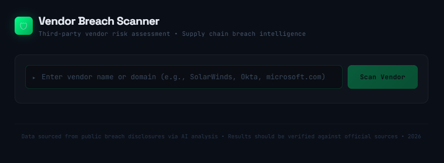
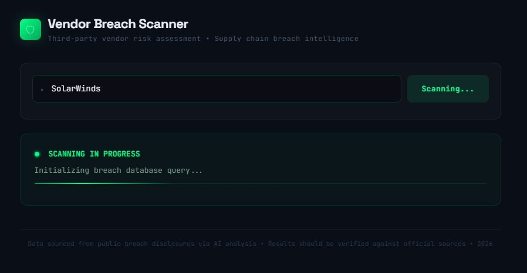
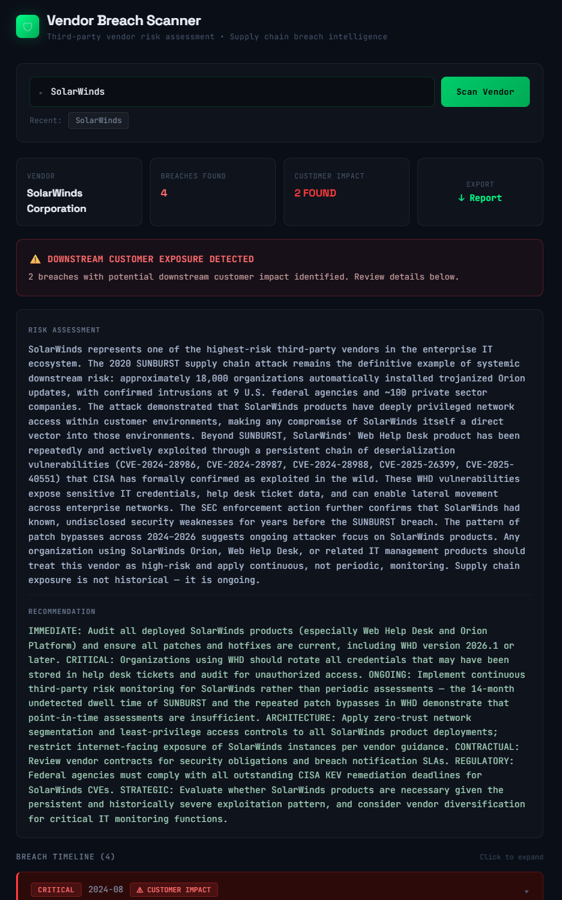
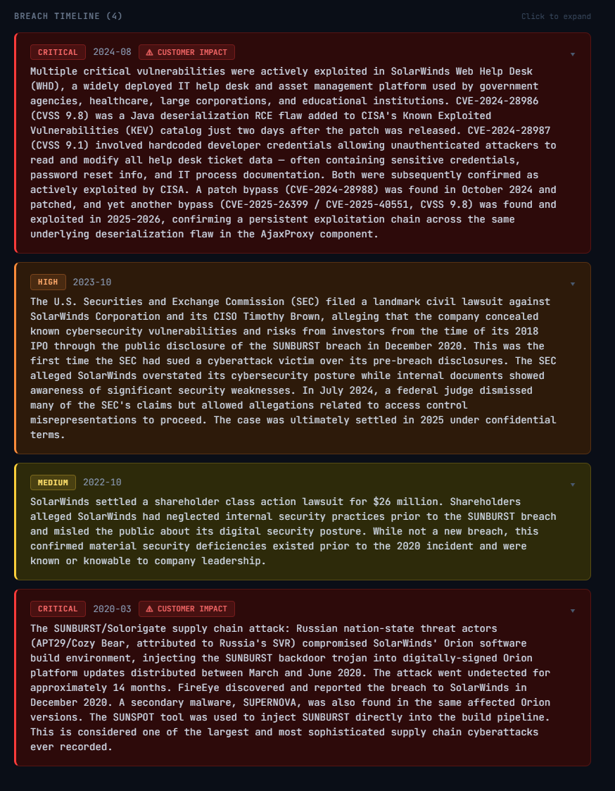

# 🛡️ Vendor Breach Scanner

An AI-powered third-party vendor risk assessment tool that researches publicly disclosed data breaches in real time. Built to support cybersecurity and vendor risk workflows, with a focus on identifying supply chain exposure for downstream customers and partners.

---

## Overview

Vendor risk teams spend significant time manually searching for breach history on third-party vendors. This tool automates that process — enter a vendor name or domain, and it uses Claude AI with live web search to return a structured breach report in seconds.

Built by someone working in vendor risk assessment at Fortress Information Security, with a broader interest in applying AI automation and business analytics to security operations workflows.

## Screenshots









---

## Features

- 🔍 **Real-time breach research** — live web search via Claude AI, no static database
- 📋 **Structured JSON output** — severity ratings, attack vectors, records affected, remediation steps
- ⚠️ **Downstream impact analysis** — flags breaches with known customer or partner exposure
- 📁 **Export reports** — download a formatted `.txt` breach assessment report
- 🕓 **Scan history** — quick-access recent searches within the session
- 📊 **Session summary** — multi-vendor comparison view when scanning in bulk
- 🎨 **Professional UI** — dark cybersecurity aesthetic built entirely in React

---

## Tech Stack

| Layer | Technology |
|---|---|
| Frontend | React (single component) |
| AI Backend | Anthropic Claude API (`claude-sonnet-4-20250514`) |
| Web Search | Anthropic Web Search Tool |
| Styling | Inline CSS with CSS animations |
| Fonts | JetBrains Mono, Space Grotesk |

---

## How It Works

1. User enters a vendor name or domain
2. A prompt is sent to Claude via the Anthropic API with web search enabled
3. Claude searches public breach disclosures, security advisories, and news sources
4. Results are returned as structured JSON and rendered as interactive breach cards
5. User can expand each breach for full details or export the full report

---

## Running Locally

This component is built to run inside the **Claude.ai artifact sandbox**, where the Anthropic API is available without additional auth configuration.

To run it as a standalone application:

### 1. Clone the repo
```bash
git clone https://github.com/YOUR_USERNAME/vendor-breach-scanner.git
cd vendor-breach-scanner
```

### 2. Set up a Next.js project
```bash
npx create-next-app@latest .
```

### 3. Create a secure API route

Create `pages/api/scan.js` (or `app/api/scan/route.js` for App Router):

```js
export default async function handler(req, res) {
  const response = await fetch("https://api.anthropic.com/v1/messages", {
    method: "POST",
    headers: {
      "Content-Type": "application/json",
      "x-api-key": process.env.ANTHROPIC_API_KEY,
      "anthropic-version": "2023-06-01",
    },
    body: JSON.stringify(req.body),
  });
  const data = await response.json();
  res.status(response.status).json(data);
}
```

### 4. Add your API key

Create a `.env.local` file:
```
ANTHROPIC_API_KEY=your_key_here
```

> ⚠️ Never commit your API key. `.env.local` is included in `.gitignore` by default.

### 5. Update the fetch URL in the component

Change:
```js
fetch("https://api.anthropic.com/v1/messages", ...)
```
To:
```js
fetch("/api/scan", ...)
```

### 6. Run the app
```bash
npm run dev
```

---

## Deployment

Recommended: **Vercel** (free tier, zero config for Next.js)

1. Push to GitHub
2. Import repo at [vercel.com](https://vercel.com)
3. Add `ANTHROPIC_API_KEY` as an environment variable in Vercel project settings
4. Deploy

Set a monthly spend cap in the [Anthropic Console](https://console.anthropic.com) to control costs.

---

## Cost Estimate

Each vendor scan uses Claude with web search enabled. Estimated cost per scan is roughly **$0.02–$0.10** depending on how many web searches are triggered and response length.

---

## Disclaimer

Results are sourced from publicly available breach disclosures via AI-assisted web search. All findings should be verified against official sources before use in formal risk assessments.

---

## License

MIT
